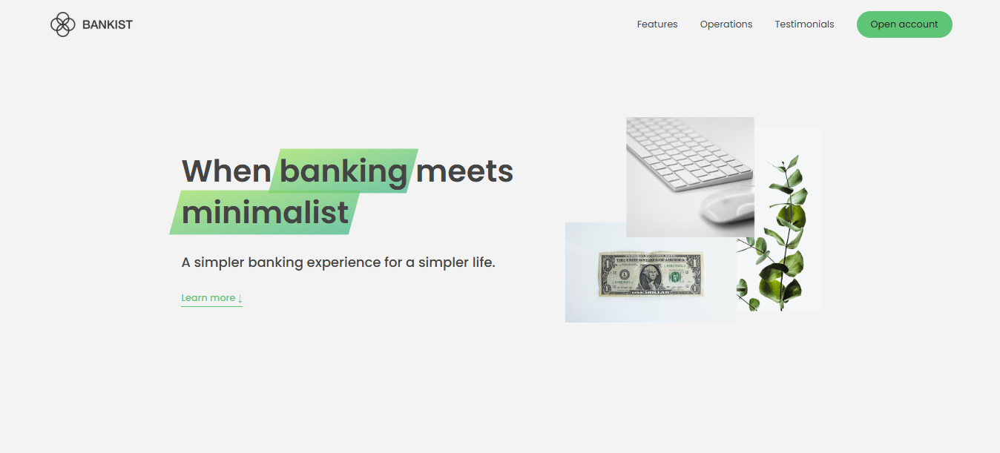

# Bankist Website

## Preview

## Live Demo

https://abdul-muqeet-niazi.github.io/Bankist-Web-Project/

## Overview

Bankist Website is a responsive front-end banking interface built using **HTML, CSS, and JavaScript**. The project demonstrates modern JavaScript concepts such as **DOM Manipulation** and the **IntersectionObserver API** to create smooth and interactive UI behavior. It is based on my previously open-sourced **Bankist Application**, but this project focuses only on the **website interface** rather than banking functionalities.

## Features

* Fully **responsive design** (desktop, tablet, and mobile)
* **Smooth scrolling navigation**
* **Sticky navigation bar**
* **Modal window component**
* **Tabbed operations section**
* **Section reveal animation on scroll**
* **Lazy loading images**
* **Slider / Carousel component**
* Interactive UI built using **DOM Manipulation**
* Performance optimization using **IntersectionObserver API**

## Technologies Used

* HTML5
* CSS3
* JavaScript (ES6+)
* DOM Manipulation
* IntersectionObserver API

## What I Learned

* DOM Traversing
* Event Delegation
* Building interactive UI components
* Using the IntersectionObserver API
* Creating responsive layouts

## Note

This project focuses only on the **Bankist website UI**. Banking features such as **transaction history, money transfers, loan requests, and account management** are implemented in the **Bankist Application** project.

## Author

**Abdul Muqeet**,
Computer Science Student,
Aspiring Software Engineer
